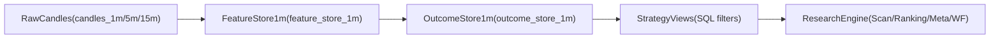

# Research Data Platform (Strategy-Agnostic)

전략을 코드로 박아 넣지 않고, **데이터는 한 번 만들고 전략은 필터/조합만 바꾸면서 실험**할 수 있게 하는 연구용 데이터 플랫폼 설계.

---

## 1. 전체 아키텍처

Raw candles → Feature store → Outcome store → Strategy views → Research engine



핵심 철학:

- **데이터 생성은 느리지만 한 번만** (feature/outcome 빌더)
- **전략 실험은 빠르고 무한히** (SQL/필터/랭킹 조합)

---

## 2. 테이블 개요

- Raw:
  - `candles_1m`, `candles_5m`, `candles_15m` (append-only, 수정 금지)
- Feature store:
  - `feature_store_1m` (`FeatureStore1mModel`)
- Outcome store:
  - `outcome_store_1m` (`OutcomeStore1mModel`)
- 증분 상태:
  - `research_pipeline_state` (`ResearchPipelineStateModel`)
- 데이터셋/실험 관리:
  - `dataset_snapshot` (`DatasetSnapshotModel`)
  - `research_experiments` (`ResearchExperimentModel`)
  - `dataset_stats` (`DatasetStatsModel`)
- 메타/설정/모니터링:
  - `feature_metadata` (`FeatureMetadataModel`)
  - `strategy_config` (`StrategyConfigModel`)
  - `pipeline_logs` (`PipelineLogModel`)

---

## 3. Feature Store (`feature_store_1m`)

- 모델: `storage/models.py` → `FeatureStore1mModel`
- PK: `(symbol, timestamp)`
- 버전: `feature_version INT NOT NULL DEFAULT 1`

### 3.1 주요 컬럼 그룹

- **Price/basic**
  - `open, high, low, close, volume, quote_volume, trade_count, taker_buy_volume, taker_buy_quote_volume`
- **Trend**
  - EMA: `ema20_1m/50_1m/200_1m`, `ema20_5m/50_5m/200_5m`, `ema20_15m/50_15m/200_15m`
  - Slope: `ema20_slope_1m`, `ema50_slope_1m`, `ema200_slope_1m`, `ema50_slope_5m`, `ema50_slope_15m`
  - Distance/Spread: `dist_from_ema20_pct/ema50_pct/ema200_pct`, `ema20_50_spread_pct`, `ema50_200_spread_pct`, `ema20_200_spread_pct`
  - Structure: `ema20_gt_ema50`, `ema50_gt_ema200`, `ema_stack_score`
- **Momentum**
  - `rsi_1m, rsi_5m, rsi_15m, rsi_delta, rsi_slope`
  - `momentum_ratio`
- **Candle structure**
  - `body_pct, range_pct, body_to_range_ratio`
  - `upper_wick_ratio, lower_wick_ratio`
  - `close_near_high, close_near_low, close_in_range_pct`
- **Volatility**
  - ATR/NATR: `atr_1m/5m/15m`, `natr_1m/5m/15m`
  - Ratios: `atr_ratio_1m_5m`, `atr_ratio_5m_15m`
  - Range: `range_ma20`, `range_zscore`
- **Volume**
  - `volume_ma20, volume_ratio, volume_zscore, volume_change_pct`
  - `volume_ratio_5m, volume_ratio_15m`
- **Position**
  - `recent_high_20, recent_low_20`
  - `dist_from_recent_high_pct, dist_from_recent_low_pct`
  - `close_in_recent_range`
- **Pullback / Breakout**
  - `pullback_depth_pct, breakout_confirmation, breakout_strength`
- **Regime**
  - `adx_14, ema50_slope_pct, natr_regime`
  - `regime_score, regime_label, regime_tradable`

### 3.2 Feature Builder

- 파일: `features/feature_builder_1m.py`
- 핵심 함수:
  - `update_feature_store(symbols: Iterable[str])`:
    - `ResearchPipelineStateModel.last_feature_timestamp` 이후 구간의 `candles_1m`을 로딩.
    - 각 1m timestamp에 대해 5m/15m 윈도우 + `strategy.feature_extractor.extract_feature_values`를 사용해 기본 피처 계산.
    - Regime feature는 `features.regime.compute_regime_features` (추후 확장)로 채움.
    - 결과를 `FeatureStore1mModel`로 `merge()` (upsert).

---

## 4. Outcome Store (`outcome_store_1m`)

- 모델: `storage/models.py` → `OutcomeStore1mModel`
- PK: `(symbol, timestamp)`

### 4.1 라벨 구성

- **Future returns**
  - `future_r_{h}` for h ∈ {1,2,3,5,8,10,15,20,30,45,60,90,120,180,240}
- **MFE/MAE**
  - `mfe_{h}, mae_{h}` for h ∈ {3,5,10,20,30,60}
- **Binary wins**
  - `win_3, win_5, win_10, win_20, win_30` (해당 horizon에서 수익률 > 0)
- **Barrier labels**
  - `tp_03_sl_02_hit` (예: 3% / -2%)
  - `tp_05_sl_03_hit`
  - `tp_10_sl_05_hit`

### 4.2 Outcome Builder

- 파일: `analysis/outcome_builder.py`
- 핵심 함수:
  - `update_outcome_store(symbols: Iterable[str])`:
    - `ResearchPipelineStateModel.last_outcome_timestamp` 이후 구간의 1m candles 로딩.
    - 각 timestamp에서 **미래 N봉**을 스캔해:
      - `future_r_*`, `mfe_*`, `mae_*`, `win_*`, barrier hit 라벨 계산.
    - 마지막 `max_horizon` 봉은 horizon 부족으로 다음 업데이트 때 계산.

---

## 5. 증분 상태 관리 (`research_pipeline_state`)

- 모델: `ResearchPipelineStateModel`
  - `id` (고정 1)
  - `last_feature_timestamp`
  - `last_outcome_timestamp`
- 동작:
  - Feature 업데이트:
    - 이 timestamp 이후의 raw candles만 피처 계산.
  - Outcome 업데이트:
    - 이 timestamp 이후 + `max_horizon` 고려한 안전 구간만 계산.

---

## 6. 업데이트 스크립트 (`scripts/update_research_data.py`)

- 사용법:

```bash
python -m scripts.update_research_data --all-symbols
python -m scripts.update_research_data --symbols BTCUSDT ETHUSDT
```

- 역할:
  - `storage.database.init_db()`로 테이블 생성 보장.
  - 심볼 리스트 로드 (`config/symbols.json`).
  - `update_feature_store(symbols)` → `update_outcome_store(symbols)` 순서로 증분 업데이트 수행.

---

## 7. Research Engine 통합

### 7.1 공용 로더 (`analysis/store_loader.py`)

- 함수: `load_rows_from_store(symbol, limit, feature_version, extra_filters=None)`
  - `feature_store_1m` + `outcome_store_1m` 조인 결과를 `list[dict]`로 반환.
  - `extra_filters`로 전략별 추가 WHERE 조건 적용 가능.

### 7.2 기존 분석 스크립트 적응

- `analysis/run_signal_ranking.py`
- `analysis/run_meta_labeling.py`
- `analysis/run_stability_scan.py`
- `analysis/run_entry_quality_scan.py`

이제 기본적으로:

- **1순위**: `load_rows_from_store(...)` 로 feature/outcome store에서 직접 로드.
- **2순위 (fallback)**: 기존 `candidate_signals + signal_outcomes` 경로 유지.

→ 점진적으로 store 기반 경로를 검증하고, 나중에는 기본값을 store로 전환할 수 있음.

---

## 8. Strategy Views (`analysis/strategy_views.py`)

전략별로 **필터/조합만 바꾸는 뷰**를 제공:

- 예:
  - `get_breakout_candidates(symbol, limit, feature_version)`
  - `get_pullback_candidates(...)`
  - `get_mean_reversion_candidates(...)`

내부 구현:

- 단순 SQLAlchemy 쿼리 혹은 `load_rows_from_store(..., extra_filters=...)` 조합.
- 예 (브레이크아웃):
  - `volume_zscore > 2`
  - `close_near_high > 0.8`
  - `ema50_slope_15m > 0`

이렇게 만들어진 후보 집합을 그대로:

- 파라미터 스캔
- Entry quality 분석
- Ranking
- Meta labeling
- Walk-forward

에 입력으로 사용할 수 있다.

---

## 9. Dataset / Experiment 관리

- `DatasetSnapshotModel`:
  - `dataset_id`, `feature_version`, `symbol`, 기간, row 수, notes 저장.
- `ResearchExperimentModel`:
  - 각 `run_research_pipeline` / `run_research_cycle` 결과를
    - `experiment_id`, `strategy_name`, `dataset_id`, 파라미터, 성과지표로 기록.
- `DatasetStatsModel`:
  - 각 dataset에 대한 regime/연도 분포, trade_count 등 요약 통계 저장.

→ 나중에 “어떤 데이터셋, 어떤 전략/파라미터 조합이 좋았는지”를 DB 질의 한 번으로 복원할 수 있음.

---

## 10. 메타/설정/모니터링

- `FeatureMetadataModel`:
  - feature별 설명/카테고리/공식 관리.
- `StrategyConfigModel`:
  - `strategy_name`별 filters/ranking JSON 정의.
- `PipelineLogModel`:
  - feature/outcome 업데이트, batch 파이프라인 상태/에러/소요시간 기록.

이 레이어들을 활용하면:

- 전략/피처/실험을 코드 수정 없이 설정/SQL 수준에서 조합할 수 있고,
- 연구/운영 로그를 일관되게 추적할 수 있다.

